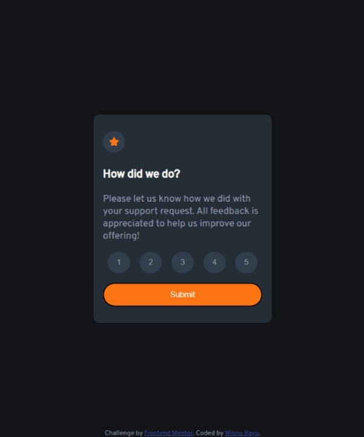
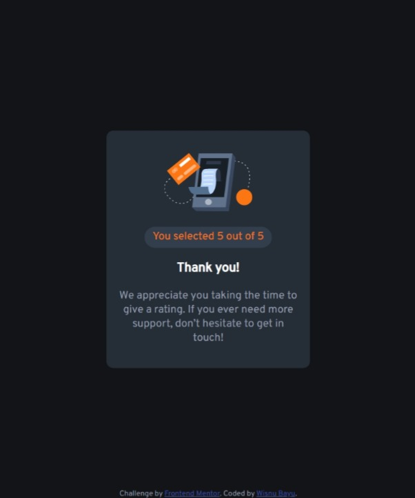

# Frontend Mentor - Interactive rating component solution

This is a solution to the [Interactive rating component challenge on Frontend Mentor](https://www.frontendmentor.io/challenges/interactive-rating-component-koxpeBUmI). Frontend Mentor challenges help you improve your coding skills by building realistic projects. 

## Table of contents

- [Overview](#overview)
  - [The challenge](#the-challenge)
  - [Screenshot](#screenshot)
  - [Links](#links)
- [My process](#my-process)
  - [Useful resources](#useful-resources)
- [Author](#author)

## Overview

### The challenge

Users should be able to:

- View the optimal layout for the app depending on their device's screen size
- See hover states for all interactive elements on the page
- Select and submit a number rating
- See the "Thank you" card state after submitting a rating

### Screenshot

### Links

- Solution URL: [Frontendmentor solution URL](https://www.frontendmentor.io/solutions/interactive-rating-component-using-foreach-4GVdIi24nv)
- Live Site URL: [Live site URL](https://wishba.github.io/interactive-rating-component-main/)

## My process

### Useful resources

- [css-tricks centering guide](https://css-tricks.com/centering-css-complete-guide/) - Help me centering element.
- [How to code a 5 star rating widget](https://youtu.be/dsRJTxieD4U?t=201) - JavaScript array forEach() use case.

## Author

- Github - [wishba](https://github.com/wishba)
- Frontend Mentor - [wishba](https://www.frontendmentor.io/profile/wishba)
- Twitter - [wishba_](https://twitter.com/wishba_)
